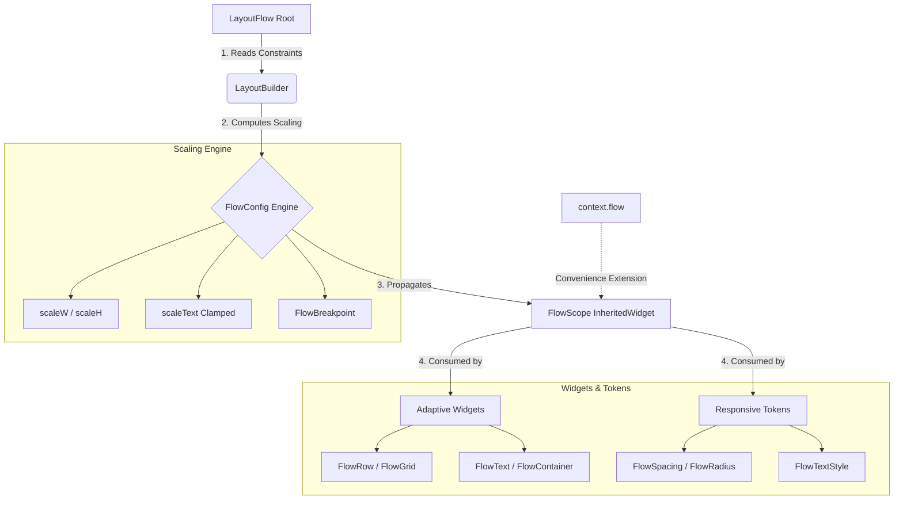

# layout_flow

[](https://pub.dev/packages/layout_flow)
[](https://opensource.org/licenses/MIT)
[](https://flutter.dev)

**Write UI once. Let it flow across every screen.**

`layout_flow` is a constraint-driven, adaptive layout system for Flutter. It eliminates manual screen sizing, font scaling, and breakpoint boilerplate — so you write UI once and it just works on phones, tablets, and the web.


> **Adaptive Layout:** Resize the window or rotate your device — `FlowRow` and `FlowGrid` handle the switching automatically, while all text and spacing scales with zero extra code.

---

## The problem with existing approaches

Building responsive Flutter UIs today usually involves:
- **Raw MediaQuery**: Fragile magic numbers and boilerplate in every file.
- **ScreenUtil Extensions**: Suffixing every number with `.w` or `.sp` (cluttering your code).
- **Code Duplication**: Maintaining multiple widget trees for different screen sizes.

**`layout_flow` fixes this by providing a unified token system and smart widgets that adapt based on parent constraints.**

---

## How it works



---

## Quick Start

### 1. Setup the Root
Wrap your app with `LayoutFlow` and specify your design reference size (usually your Figma frame).

```dart
void main() {
  runApp(
    LayoutFlow(
      designSize: const Size(375, 812), // Your design reference
      child: const MyApp(),
    ),
  );
}
```

### 2. Use Adaptive Widgets
Write your UI using specialized widgets that understand scaling and breakpoints.

```dart
class ProfileCard extends StatelessWidget {
  @override
  Widget build(BuildContext context) {
    return FlowContainer(
      child: FlowRow(
        gap: FlowSpacing.md(context),
        children: [
          const CircleAvatar(radius: 30),
          Expanded(
            child: Column(
              crossAxisAlignment: CrossAxisAlignment.start,
              children: [
                FlowText('John Doe', style: FlowTextStyle.title(context)),
                FlowText('Developer', style: FlowTextStyle.bodySmall(context)),
              ],
            ),
          ),
        ],
      ),
    );
  }
}
```

---

## Core Widgets

### FlowRow — Smart Switcher
The workhorse of adaptive layout. It sits as a `Row` on tablets/desktops and collapses into a `Column` on phones.
- **Default**: Uses local constraints (safe for sidebars).
- **Named Modes**: `.orientation()` for portrait/landscape or `.breakpoint()` for fixed widths.

### FlowNavigationBar — Adaptive Navigation
Automatically transitions between a `BottomNavigationBar` (mobile) and a `NavigationRail` (tablet/desktop).

```dart
FlowScaffold(
  navigation: FlowNavigationBar(
    selectedIndex: _index,
    onDestinationSelected: (i) => setState(() => _index = i),
    destinations: [
      FlowNavigationDestination(icon: Icons.home, label: 'Home'),
      FlowNavigationDestination(icon: Icons.settings, label: 'Settings'),
    ],
  ),
  body: MyContent(),
)
```

### FlowGrid — Responsive Columns
Define column counts per breakpoint. No more manual modulo math or `MediaQuery` checks.
```dart
FlowGrid(
  columns: const FlowGridColumns(compact: 1, medium: 2, expanded: 4),
  gap: FlowSpacing.md(context),
  children: [ ... ],
)
```

### FlowVisibility — Conditional Display
Declaratively show or hide components based on active breakpoints.
```dart
FlowVisibility.expandedOnly(child: DesktopSidebar())
```

### FlowDebugOverlay — Visual Inspector
Add this to your root in debug mode to see active breakpoints and scale factors live on screen.

---

## Design Tokens

Tokens ensure your app remains consistent. They are based on an **8pt grid** by default but can be customized via `FlowTheme`.

| Token | Purpose | Scaling |
|---|---|---|
| **FlowSpacing** | Padding, Margins, Gaps | Width-based (`scaleW`) |
| **FlowTextStyle** | Typography system | Clamped Text-based (`scaleText`) |
| **FlowRadius** | Border radii | Symmetric-based (`sp`) |

### Customizing the Grid
Override the base unit for your entire design system:
```dart
ThemeData(
  extensions: [
    const FlowTheme(spacingBase: 10.0), // All tokens now derive from 10pt
  ],
)
```

---

## Extensions
v0.2.0 adds powerful extensions to `BuildContext`:
- `context.flow`: Access the scaling engine.
- `context.isCompact` / `context.isMedium` / `context.isExpanded`: Quick breakpoint checks.
- `context.flowBreakpoint`: Get the current `FlowBreakpoint` enum.

---

## Roadmap

### v0.2.0 (Current)
- [x] FlowGrid — responsive grid with auto column count
- [x] FlowScaffold — full-page adaptive layout shell
- [x] FlowNavigationBar — adaptive navigation rail/bottom bar
- [x] FlowSidebar — advanced collapsible sidebar
- [x] FlowDebugOverlay — live scale factor inspector
- [x] DevTools Extension — browser-integrated inspector
- [x] CLI Migration Tool — automatic `MediaQuery` refactoring

### Future
- [ ] Adaptive Navigation Rail — nested navigation & sub-menus
- [ ] Desktop/Web Optimized — hover & cursor global styles
- [ ] Theme Builder — GUI for generating `FlowTheme` values

---

## License
MIT — see [LICENSE](LICENSE).
