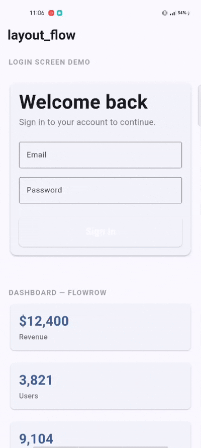
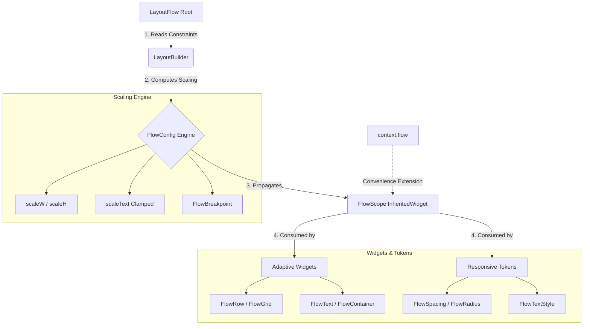

# layout_flow

[](https://pub.dev/packages/layout_flow)
[](https://opensource.org/licenses/MIT)
[](https://flutter.dev)

**Write UI once. Let it flow across every screen.**

`layout_flow` is a constraint-driven, adaptive layout system for Flutter. It eliminates manual screen sizing, font scaling, and breakpoint boilerplate — so you write UI once and it just works on phones, tablets, and the web.



---

## 🚀 Key Features (v0.2.0)

- **Constraint-First Design**: Widgets adapt based on their *parent* size, not just the device screen.
- **Adaptive Components**: `FlowScaffold`, `FlowGrid`, and `FlowNavigationBar` handle complex UI transitions automatically.
- **Responsive Tokens**: Spacing, Typography, and Radii that scale proportionally without `.w` or `.h` clutter.
- **Zero-Boilerplate Breakpoints**: Extensions like `context.isCompact` and `context.isExpanded`.
- **Interactive DevTools**: On-screen draggable debug overlay for real-time inspection.
- **CLI Migration Tool**: Refactor legacy `MediaQuery` apps to `layout_flow` in seconds.

---

## 🛠 How it works



---

## 📦 Quick Start

### 1. Setup the Root
Wrap your app with `LayoutFlow` and specify your design reference size (usually your Figma frame).

```dart
void main() {
  runApp(
    const LayoutFlow(
      designSize: Size(375, 812), // Your Figma design size
      child: MyApp(),
    ),
  );
}
```

### 2. Use the Adaptive Shell
Use `FlowScaffold` to automatically handle sidebars on desktop and bottom bars on mobile.

```dart
FlowScaffold(
  navigation: FlowNavigationBar(
    destinations: [
      FlowNavigationDestination(icon: Icons.dashboard, label: 'Home'),
      FlowNavigationDestination(icon: Icons.settings, label: 'Settings'),
    ],
  ),
  body: DashboardContent(),
)
```

---

## 🧩 Core Components

### FlowGrid — Responsive Grid
Define column counts per breakpoint. No more manual math or `MediaQuery` checks.
```dart
FlowGrid(
  columns: const FlowGridColumns(compact: 1, medium: 2, expanded: 4),
  gap: FlowSpacing.md(context),
  children: [ StatCard(), ... ],
)
```

### FlowSpacing — Smart Tokens
Tokens ensure your app remains consistent across orientations. v0.2.0 uses **Symmetric Scaling** to prevent layout "explosion" in landscape.

```dart
Container(
  padding: FlowSpacing.all(context, 16), // Scales perfectly across all breakpoints
  child: FlowText('Pro-grade adaptive UI', style: FlowTextStyle.title(context)),
)
```

### FlowDebugOverlay — Draggable Inspector
Add this to your root in debug mode. It's interactive, draggable, and collapsible.
```dart
FlowDebugOverlay(
  enabled: kDebugMode,
  child: MyApp(),
)
```

---

## ⚡ CLI Migration Tool
Already have a project using `MediaQuery.of(context).size.width`? Migrate to `layout_flow` extensions automatically:

```bash
dart run layout_flow migrate
```
*This tool refactors your codebase to use context extensions and responsive tokens.*

---

## 📱 BuildContext Extensions
v0.2.0 adds powerful extensions to `BuildContext`:
- `context.flow`: Access the scaling engine.
- `context.isCompact` / `context.isMedium` / `context.isExpanded`: Quick breakpoint checks.
- `context.flowBreakpoint`: Get the current `FlowBreakpoint` enum.

---

## 🗺 Roadmap

### v0.2.0 (Latest Release)
- [x] **FlowGrid**: Auto column count per breakpoint
- [x] **FlowScaffold**: Adaptive layout shell with Sidebar/Rail support
- [x] **CLI Migration Tool**: Automated `MediaQuery` refactoring
- [x] **Interactive Overlay**: Draggable & collapsible debug tool
- [x] **Constraint-First**: Engine optimized for embedded/nested layouts

### Future (v1.0.0)
- [ ] **Adaptive Navigation Rail**: Advanced nested navigation & sub-menus
- [ ] **Adaptive Hover**: Desktop-first hover & cursor states
- [ ] **Layout Flow CLI**: Create new projects with pre-configured adaptive components

---

## 📄 License
MIT — see [LICENSE](LICENSE).
